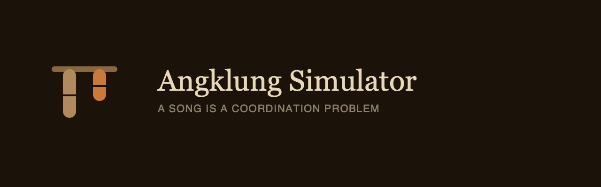

<div align="center">



**Satu angklung hanya bisa membunyikan satu nada.**<br>
**Maka sebuah lagu adalah persoalan koordinasi — dan itulah yang disimulasikan di sini.**

[**Buka simulatornya →**](https://andifathulms.github.io/angklung-simulator/)

[](https://github.com/andifathulms/angklung-simulator/actions)
[](#yang-diuji-bukan-didengarkan)
[](#bunyinya-dihitung-bukan-direkam)

</div>

---

Hampir semua aplikasi angklung di internet adalah papan suara: ketuk gambar bambu, keluar nada. Itu menirukan bunyinya dan melewatkan alat musiknya.

Angklung adalah **alat musik yang tersebar**. Satu angklung satu nada, jadi satu lagu butuh satu ruangan berisi orang — masing-masing memegang satu atau dua angklung, masing-masing menunggu giliran nadanya tiba. Yang disimulasikan di sini bukan bunyinya saja, melainkan koordinasinya.

> *An angklung simulator built around the coordination problem: one angklung is one note, so a song needs many players. The instrument is synthesised from a physical model of a bamboo tube — no sampled audio anywhere. Static site, no backend, no network at runtime.*

## Yang membuatnya berbeda

**Tiga teknik, satu model.**
Kurulung, centok, dan tengkep bukan tiga berkas suara, melainkan tiga pola pukulan di atas satu bank resonator yang sama. Kalau ketiganya menjadi tiga rekaman, tidak ada yang dipelajari.

**Tengkep menghapus resonator dari penjumlahan.**
Bukan menyaring, bukan mengecilkan volume. Pada angklung akompanimen mayor, empat tabung berbunyi sebagai akor septim dominan; kelingking pemain menahan satu tabung dan yang tersisa adalah trinada mayor. **Kelingking pemain adalah sakelar kualitas akor** — dan itu fakta paling menarik tentang rancangan alat musik ini.

**Penjadwalan memakai jam audio, tidak pernah `setTimeout`.**
Nada yang dijadwalkan lewat timer melenceng dalam hitungan detik. Pada simulator ansambel, melencengnya jadwal adalah satu-satunya bug yang menghancurkan seluruh gagasannya.

**Ansambelnya adalah produknya.**
Satu angklung yang bisa dibunyikan hanyalah papan suara, dan papan suara sudah ada banyak.

## Bunyinya dihitung, bukan direkam

Merekam angklung sungguhan berarti mengurus lisensi rekaman. Proyek ini menghindarinya sejak rancangan: **tidak ada satu pun berkas audio di repositori maupun di bundelnya**, dan `scripts/postbuild.mjs` menolak build kalau sampai ada.

Sebagai gantinya, sebuah tabung bambu dimodelkan apa adanya — sebagai resonator modal:

```
teknik + nada + laras
  → pola pukulan (deret impuls)
  → bank resonator modal (per tabung)
  → campur → Float32Array

melodi + set + jumlah pemain
  → pembagian → bagian tiap pemain
  → penjadwal (jam audio) → pukulan terjadwal
```

Tabung angklung adalah pipa tertutup, jadi parsialnya ganjil (1, 3, 5) dan **tidak ada apa pun di 2f**. Ketiadaan itulah yang menanggung beban: karena tidak ada yang berbunyi di 2f, tabung oktaf menjadi satu-satunya sumber di sana — dan justru itu yang membuat tengkep bisa **diukur**, bukan sekadar diyakini.

## Menjalankan

```bash
pnpm install
pnpm dev
```

| Perintah | Kegunaan |
|---|---|
| `pnpm test:run` | Seluruh uji, sekali jalan |
| `pnpm test:synth` | Render luring: nada, parsial, jumlah pukulan, determinisme |
| `pnpm test:distribution` | Sifat pembagian + kecocokan dengan brute force |
| `pnpm bench:voices` | Beban polifoni pada ukuran ansambel penuh |
| `pnpm data:validate` | Kutipan laras, definisi set, asal-usul melodi |
| `pnpm build` | Ekspor statis ke `./out` |
| `pnpm preview` | Melayani `./out` di bawah basePath produksi |

Halaman `/diagnostik` mengukur beban audio di perangkat yang sedang dipakai — satu-satunya cara mengetahui perilaku ponsel yang sebenarnya.

## Susunan

```
lib/synth/       INTI. Murni, bisa dirender di Node. Tanpa Web Audio, tanpa DOM.
  resonator.ts     bank modal per tabung
  excitation.ts    pola kurulung | centok | tengkep
  angklung.ts      susunan tabung → angklung melodi / akompanimen
  render.ts        params → Float32Array
lib/audio/       batas Web Audio: konteks, suara, penjadwal lookahead
lib/tuning/      laras, sen, pemetaan nada
lib/set/         definisi set angklung, penomoran padaeng
lib/distribute/  melodi + pemain → pembagian; pelaporan ketidakmungkinan
data/            laras, set, dan melodi — semuanya berkutipan dan bisa disunting
```

`lib/synth` murni dan berjalan di Node. Itulah yang membuat bunyinya bisa **diukur**, bukan dinilai dengan telinga.

## Yang diuji, bukan didengarkan

| Yang diuji | Caranya |
|---|---|
| **Nada** | Fundamental hasil render diukur dengan FFT, dalam ±10 sen di seluruh set padaeng |
| **Tengkep** | Dua arah — dan bentuk paling tegasnya: render tengkep identik sampel-per-sampel dengan render angklung yang memang tidak punya tabung itu |
| **Akor akompanimen** | Empat nada membentuk septim dominan, tiga membentuk trinada mayor. Terkunci sebagai fixture |
| **Centok** | Tepat satu pukulan, dideteksi lewat fluks spektral |
| **Kurulung** | Laju pukulannya berada dalam rentang 2–3 Hz yang dikutip |
| **Determinisme** | Parameter dan seed yang sama menghasilkan render identik byte-per-byte |
| **Pembagian** | Tidak ada nada yang dibuang diam-diam; jumlah pemain minimum dicocokkan dengan brute force |
| **Penjadwalan** | 4800 kejadian tanpa pergeseran yang terukur |

Kalau uji sintesis gagal, **modelnya yang salah — bukan toleransinya.**

## Laras dan kejujuran datanya

Angklung padaeng bersifat diatonis-kromatis, dan angkanya memang definisi, bukan pengukuran. **Salendro dan pelog degung tidak punya standar baku dan berbeda antar perangkat**, jadi keduanya dimuat sebagai satu set interval terdokumentasi — dengan sumbernya, dengan catatan **di mana angkanya berhenti terverifikasi**, dan nilai sennya bisa Anda ubah langsung di halaman Laras.

Setiap laras, set, dan melodi wajib punya `caveat`. Uji dan `pnpm data:validate` menolak yang tidak punya: kutipan tanpa keterangan keraguan hanyalah hiasan.

Melodi hanya dimuat kalau domain publik atau ciptaan sendiri. **Belum ada lagu rakyat Sunda di sini**, dan itu disengaja — memuat melodi yang keliru dengan nama aslinya adalah penggambaran yang salah terhadap tradisi yang masih hidup. Syarat untuk mengisinya dicatat di [`data/melodies/README.md`](data/melodies/README.md).

## Penghargaan

**Daeng Soetigna** menciptakan angklung padaeng yang diatonis-kromatis pada 1938, khusus agar angklung bisa bermain bersama alat musik Barat. **Udjo Ngalagena** mengembangkan teknik permainan di atas laras salendro dan pelog degung.

[Saung Angklung Udjo](https://angklung-udjo.co.id/) dan sanggar-sanggar setempat adalah tempat mempelajari yang sebenarnya; simulator di peramban hanyalah pintu masuk.

Ini proyek pribadi untuk belajar, bukan otoritas. Laras dan teknik berbeda antar tradisi dan antar guru. Angklung buhun hidup dalam ritual pertanian padi dan penghormatan kepada Nyai Sri Pohaci — konteks itu disebut dengan hormat dan **tidak disimulasikan**.

## Penerbitan

`main` dibangun dan diterbitkan lewat GitHub Actions ke GitHub Pages. Alurnya menjalankan typecheck, lint, dan seluruh uji **sebelum** membangun: alat musik yang salah tidak ikut terbit hanya karena kodenya lolos kompilasi.

Sebelum rilis apa pun yang menyentuh jalur audio, **uji penyalaan suara di perangkat iOS sungguhan** — daftar periksanya di [`docs/uji-ios.md`](docs/uji-ios.md), angkanya dari halaman `/diagnostik` di perangkat yang sama.

Aset merek didokumentasikan di [`docs/brand.md`](docs/brand.md).

---

<div align="center">
<sub><b>Angklung Simulator</b> · <a href="https://andifathulms.github.io/angklung-simulator/">andifathulms.github.io/angklung-simulator</a></sub>
</div>
